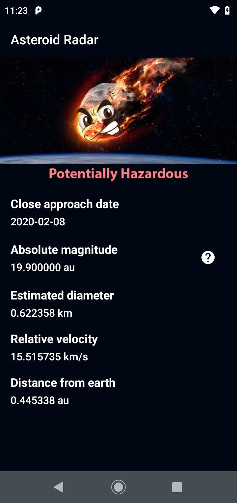

# Project Title

Asteroid Radar

## Getting Started

Asteroid Radar is an app to view the asteroids detected by NASA that pass near Earth, you can view all the detected asteroids in a period of time, their data (Size, velocity, distance to Earth) and if they are potentially hazardous.

The app is consists of two screens: A Main screen with a list of all the detected asteroids and a Details screen that is going to display the data of that asteroid once it´s selected in the Main screen list. The main screen will also show the NASA image of the day to make the app more striking.

### Screenshots





### Dependencies

```

```

### Installation

To get the project running on your local machine, you need to add the NASA API Key in local.properties `API_KEY="ADD_KEY_HERE"`, in the root of the project. You can get your own key in the link below.

## Built With

https://api.nasa.gov/